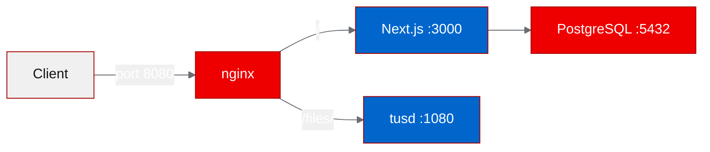
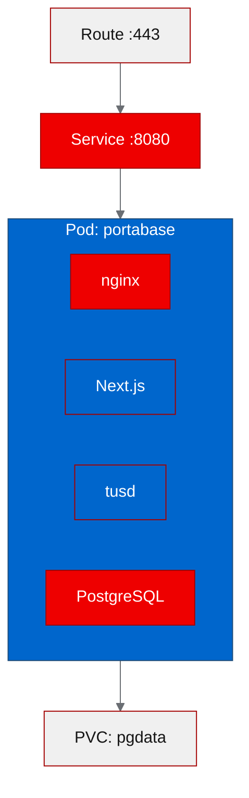

# Deploying Portabase on OpenShift: database backup management the hard way

Backing up databases sounds simple until you're juggling PostgreSQL, MongoDB, Redis, and SQLite across a dozen services. Portabase is an open source tool that consolidates backup and restore for ten database engines behind a single UI. We deployed it on OpenShift to see how well it fits into a Kubernetes-native operations workflow, and we ran into every container permission edge case along the way.

## What is Portabase?

[Portabase](https://github.com/Portabase/portabase) is a self-hosted database backup and restore management tool built with Next.js 16, TypeScript, and Drizzle ORM. It supports PostgreSQL, MySQL, MariaDB, MongoDB, SQLite, Redis, Valkey, Firebird, and MSSQL. Authentication is handled by BetterAuth, and large backup files go through [tusd](https://tus.io/) for resumable uploads.

The project has 771 stars on GitHub and ships under the Apache-2.0 license. It's designed for teams that want a single pane of glass for database backup operations instead of stitching together cron jobs and shell scripts across different database clients.

## Why it matters for OpenShift

OpenShift clusters typically run multiple databases: a PostgreSQL instance for one service, Redis for caching, maybe MongoDB for a document store. Each database has its own backup tooling, its own schedule, and its own restore procedure. When something breaks at 2 AM, you're reading three different runbooks.

Portabase centralizes that. Running it on OpenShift puts the backup management tool right next to the databases it manages, with access to cluster-internal networking. It can reach databases via Kubernetes services without exposing them externally. That's a meaningful security advantage over running backup tools outside the cluster.

## Containerizing for OpenShift

Portabase bundles several processes into a single container: nginx as a reverse proxy on port 8080, Next.js on port 3000, tusd on port 1080, and PostgreSQL 16 as its own metadata store. This isn't the typical "one process per container" pattern, but it keeps the deployment simple for a tool that's meant to run as a standalone appliance.



We built the image on UBI9 (Red Hat Universal Base Image) using OpenShift binary builds. This is where things got interesting.

**Problem 1: PostgreSQL isn't in UBI9 repos.** The default UBI9 package set doesn't include PostgreSQL 16. We added the PGDG (PostgreSQL Global Development Group) RPM repository to the Dockerfile and installed `postgresql16-server` and `postgresql16` from there.

**Problem 2: OpenShift runs containers with arbitrary UIDs.** PostgreSQL's `initdb` calls `getpwuid()` to look up the current user. OpenShift assigns a random UID from the namespace's range, and that UID doesn't exist in `/etc/passwd`. The fix is a classic OpenShift pattern: add an `nss_wrapper` entry or append the runtime UID to `/etc/passwd` in the entrypoint script.

```bash
# entrypoint workaround for arbitrary UIDs
if ! whoami &>/dev/null; then
  echo "default:x:$(id -u):0:Default:${HOME}:/bin/bash" >> /etc/passwd
fi
```

**Problem 3: PGDATA needs 0700 permissions.** PostgreSQL refuses to start if its data directory has permissions more open than `0700`. On OpenShift, the volume mount might come in with different permissions. We added a `chmod 0700 "$PGDATA"` call early in the entrypoint.

**Problem 4: Database migrations before app start.** Portabase uses Drizzle ORM for schema management, but the initial schema needs to exist before Next.js boots. We ran the migration SQL directly via `psql` in the entrypoint, after PostgreSQL starts but before the Next.js process launches.

**Problem 5: Quay rate limiting.** During iterative builds, we hit Quay.io rate limits. We switched to the OpenShift internal registry (`image-registry.openshift-image-registry.svc:5000`) for intermediate builds, which has no rate limiting and keeps image pulls cluster-local.

## Deploying to the cluster

We deployed to the `poc-portabase` namespace with a straightforward set of Kubernetes resources: a Deployment, a Service, and a Route.



The deployment uses a PersistentVolumeClaim for PostgreSQL data so backups and metadata survive pod restarts. Environment variables configure the database connection string, authentication secrets, and tusd storage path. nginx listens on 8080 (the conventional non-root port for OpenShift) and proxies traffic to the internal services.

One thing worth noting: because all four processes run in the same pod, readiness and liveness probes target nginx on port 8080. If PostgreSQL crashes but nginx is still responding, the probe won't catch it. For a production deployment, you'd want to add a health endpoint that checks database connectivity, or split the processes into separate containers within the pod.

## Running the PoC tests

We ran four validation tests against the deployed instance:

| Test | Result | Details |
|------|--------|---------|
| Health check | Passed | nginx returned 200 on `/` |
| Landing page | Passed | Page rendered with expected Portabase content |
| API config | Passed | `/api/config` returned valid JSON with app settings |
| Auth session | Failed (404) | `/api/auth/session` returned 404 |

Three out of four tests passed. The auth session endpoint returned a 404, which suggests BetterAuth's route registration didn't fully initialize, or the endpoint path differs from what we expected. This isn't a deployment failure: the application is running, serving pages, and responding to API calls. The auth issue is likely a configuration detail around BetterAuth's route prefix that would be resolved by checking the project's auth documentation.

## What we learned

**Arbitrary UIDs remain the top friction point for containerizing traditional applications on OpenShift.** PostgreSQL's `initdb` assumption that the running user exists in `/etc/passwd` is a pattern we see in almost every database container. The fix is well documented, but it catches people every time.

**Bundling multiple processes works for appliance-style tools, but complicates observability.** Health checks, log aggregation, and resource limits all get harder when four processes share a container. For a PoC this is fine. For production, consider a sidecar pattern or the built-in PostgreSQL Operator.

**Internal registries save time during iterative development.** Switching from Quay to the OpenShift internal registry eliminated rate limiting delays and kept our build-test cycle under five minutes.

**Database migration ordering matters in entrypoints.** The entrypoint script has to start PostgreSQL, wait for it to accept connections, run migrations, then start the application. Getting this sequence wrong produces cryptic "relation does not exist" errors that look like code bugs but are really timing issues.

## Try it yourself

The forked repository with OpenShift-specific modifications is at [github.com/aicatalyst-team/portabase](https://github.com/aicatalyst-team/portabase). To deploy on your own cluster:

```bash
# Create the namespace
oc new-project poc-portabase

# Apply the deployment manifests
oc apply -f .autopoc/deploy/

# Watch the rollout
oc rollout status deployment/portabase -n poc-portabase

# Get the route URL
oc get route portabase -n poc-portabase -o jsonpath='{.spec.host}'
```

The upstream project is at [github.com/Portabase/portabase](https://github.com/Portabase/portabase). If you're managing backups across multiple database engines, it's worth evaluating, especially if you're already running on OpenShift where the cluster-internal networking makes connecting to your databases straightforward.
