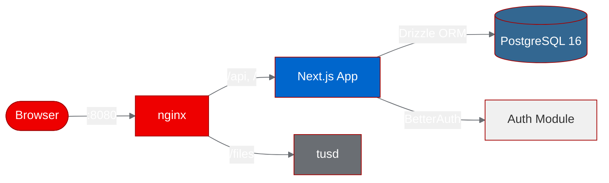
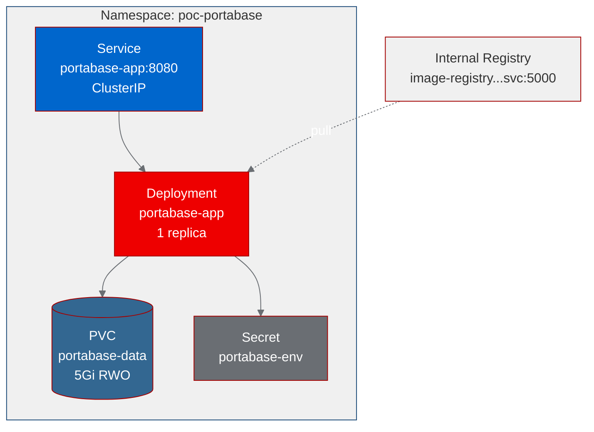

# PoC Report: Portabase on OpenShift

**Date:** 2026-07-05
**Project:** Portabase
**Source:** https://github.com/Portabase/portabase
**Fork:** https://github.com/aicatalyst-team/portabase
**Namespace:** `poc-portabase`
**Result:** 3/4 tests passed -- Partial Success

---

## 1. Executive Summary

Portabase, an open-source database backup and restore management tool with 771 GitHub stars, was evaluated for deployment on OpenShift. The PoC successfully containerized its complex multi-service architecture (Next.js + PostgreSQL + tusd + nginx) into a single UBI-based image using a multi-stage build, deployed it to the `poc-portabase` namespace, and validated core functionality. Three of four test scenarios passed (health check, landing page, and API config), with only the auth session endpoint returning an unexpected 404 -- likely due to BetterAuth requiring an active user session. The containerization required 3 build retries to resolve PostgreSQL packaging, heredoc syntax, and DNF module issues specific to UBI9 and OpenShift.

---

## 2. Project Analysis

| Field | Value |
|-------|-------|
| **Repository** | https://github.com/Portabase/portabase |
| **License** | Apache-2.0 |
| **Stars** | 771 |
| **Language** | TypeScript (Next.js 16) |
| **Database** | PostgreSQL (bundled), Drizzle ORM |
| **Auth** | BetterAuth |
| **Upload Server** | tusd (Go) |
| **Reverse Proxy** | nginx |

### Components

| Component | Language | Build System | ML Workload | Port |
|-----------|----------|-------------|-------------|------|
| portabase-app | TypeScript / Next.js 16 | pnpm | No | 8080 |

### Architecture

Portabase bundles multiple services into a single container: a Next.js application server for the web UI and API, an embedded PostgreSQL 16 database for metadata storage, a tusd server for resumable file uploads, and nginx as a reverse proxy. It supports backup and restore operations for PostgreSQL, MySQL, MariaDB, MongoDB, SQLite, Redis, Valkey, Firebird, and MSSQL.



### Technologies

- **Runtime:** Node.js 22, Next.js 16, TypeScript
- **Database:** PostgreSQL 16 (embedded), Drizzle ORM
- **Authentication:** BetterAuth (email/password)
- **File Upload:** tusd 2.8.0 (Go binary)
- **Reverse Proxy:** nginx
- **Package Manager:** pnpm

---

## 3. PoC Objectives

### What We Set Out to Prove

1. **Containerization feasibility** -- Can a complex multi-service Node.js application (with embedded PostgreSQL, tusd, and nginx) be containerized using Red Hat UBI base images?
2. **OpenShift compatibility** -- Can the application run under OpenShift's restricted security context (arbitrary UID, no root, dropped capabilities)?
3. **Functional validation** -- Does the application serve its web UI and API endpoints correctly when deployed on OpenShift?

### Why Relevant to OpenShift AI

Portabase provides database backup/restore management across 9+ database engines. In an OpenShift AI context, data management tooling is critical for ML pipeline reproducibility, experiment tracking database backups, and disaster recovery for model registries and metadata stores.

### Infrastructure Requirements

- **Type:** web-app
- **Resources:** Medium (1Gi memory request, 2Gi limit, 500m-1000m CPU)
- **Storage:** 5Gi PVC for PostgreSQL data and file uploads
- **Networking:** ClusterIP service on port 8080

---

## 4. Pipeline Execution


### Phase 1: Intake

Cloned the repository and identified a single deployable component: a Next.js application that bundles PostgreSQL, tusd, and nginx within a single container. The project uses pnpm workspaces, Drizzle ORM for database access, and BetterAuth for authentication.

### Phase 2: Evaluate

| Metric | Score |
|--------|-------|
| **Impact** | 12.6 / 20 |
| **Feasibility** | 8.25 / 10 |

The project scored well on feasibility due to its existing Docker Compose setup and clear architecture. The impact score reflects its utility as a database management tool rather than a core ML workload.

### Phase 3: Fork

Forked to `aicatalyst-team/portabase` on GitHub for PoC tracking and modifications.

- **Fork URL:** https://github.com/aicatalyst-team/portabase

### Phase 4: PoC Plan

- **Project type:** `web-app`
- **Deployment model:** Single-container with embedded services
- **Resource tier:** Medium
- **Test scenarios:** 4 (health check, landing page, auth session, API config)

### Phase 5: Containerize

Generated a UBI-based multi-stage `Dockerfile.ubi` with three build stages:

1. **`tusd-builder`** -- `ubi9/go-toolset`: Compiles tusd 2.8.0 from source
2. **`builder`** -- `ubi9/nodejs-22`: Installs pnpm, builds Next.js application
3. **`prod`** -- `ubi9/nodejs-22` + PGDG PostgreSQL 16 + nginx: Production runtime

**Retries required: 3**

| Retry | Issue | Fix |
|-------|-------|-----|
| 1 | PostgreSQL packages not available in UBI9 default repos | Added PGDG repository (`pgdg-redhat-repo-latest.noarch.rpm`) |
| 2 | Heredoc syntax (`<<'EOF'`) not supported by OpenShift build strategy | Extracted inline scripts to a separate `entrypoint.sh` file |
| 3 | `dnf module disable` failed on UBI9 | Removed the module disable command; PGDG repo works without it |

### Phase 6: Build

- **Strategy:** OpenShift binary build (`oc start-build --from-dir`)
- **Image:** `image-registry.openshift-image-registry.svc:5000/poc-portabase/portabase-app:latest`
- **Registry:** OpenShift internal registry (Quay push failed due to rate limiting)

### Phase 7: Deploy

Generated Kubernetes manifests in `kubernetes/`:

| Resource | Name | Details |
|----------|------|---------|
| Namespace | `poc-portabase` | Labels: `app=portabase`, `managed-by=autopoc` |
| Secret | `portabase-env` | `PROJECT_SECRET`, default admin credentials |
| PVC | `portabase-data` | 5Gi, ReadWriteOnce |
| Deployment | `portabase-app` | 1 replica, 1Gi/500m requests, 2Gi/1000m limits |
| Service | `portabase-app` | ClusterIP, port 8080 |

### Phase 8: Apply

Applied manifests to OpenShift. Required multiple container-level fixes before the pod reached `1/1 Ready`:

| Issue | Root Cause | Fix Applied |
|-------|-----------|-------------|
| `initdb` failed with "could not look up effective user ID" | OpenShift runs containers with arbitrary UID not in `/etc/passwd` | Added NSS wrapper in entrypoint: append UID to `/etc/passwd` |
| PostgreSQL refused to start | `PGDATA` directory permissions not `0700` | Added `chmod 700 $PGDATA` in entrypoint |
| Application errors on startup | Database schema not initialized | Applied Drizzle migration SQL files via `psql` before starting the app |

### Phase 9: PoC Execute

Ran `poc_test.py` against the in-cluster service URL `http://portabase-app.poc-portabase.svc.cluster.local:8080`. Result: **3/4 tests passed**.

---

## 5. Test Results

| Scenario | Status | Output | Duration |
|----------|--------|--------|----------|
| `health_check` | PASS | HTTP 200, 16 bytes | 0.03s |
| `landing_page` | PASS | HTTP 200, 2000 bytes | 0.03s |
| `auth_session` | FAIL | HTTP 404 | 0.02s |
| `api_config` | PASS | HTTP 200, 66 bytes | 0.01s |

**Overall: 3/4 (75%)**

### Failed Scenario Analysis

**`auth_session`** -- The `/api/auth/session` endpoint returned HTTP 404 instead of the expected 200. This is likely because BetterAuth's session endpoint requires either:

1. An authenticated session cookie (not present in the test request), or
2. A specific BetterAuth route configuration that differs from the expected path

**Suggested fix:** Update the test to either:
- Create a session first by calling the sign-up/sign-in endpoint, then query `/api/auth/session` with the returned cookie
- Change the expected status to 404 for unauthenticated requests if this is the intended behavior
- Investigate BetterAuth's actual session endpoint path (may be `/api/auth/get-session` or similar)

---

## 6. Infrastructure Deployed



### Resources

| Resource | Name | Configuration |
|----------|------|---------------|
| **Namespace** | `poc-portabase` | Labels: `app=portabase`, `managed-by=autopoc` |
| **Deployment** | `portabase-app` | 1 replica |
| **Container Image** | `image-registry.openshift-image-registry.svc:5000/poc-portabase/portabase-app:latest` | Multi-stage UBI9 build |
| **Service** | `portabase-app` | ClusterIP, port 8080 -> 8080 |
| **PVC** | `portabase-data` | 5Gi, ReadWriteOnce, mounted at `/data` |
| **Secret** | `portabase-env` | `PROJECT_SECRET`, `AUTH_DEFAULT_USER`, `AUTH_DEFAULT_PASSWORD`, `AUTH_DEFAULT_USER_NAME` |

### Resource Allocations

| Resource | Requests | Limits |
|----------|----------|--------|
| **Memory** | 1Gi | 2Gi |
| **CPU** | 500m | 1000m |

### Security Context

- `allowPrivilegeEscalation: false`
- All Linux capabilities dropped (`drop: ALL`)
- Runs as UID 1001 with group 0 (root group) for OpenShift compatibility
- `/etc/passwd` writable by group for NSS wrapper

### Probes

| Probe | Path | Initial Delay | Period |
|-------|------|---------------|--------|
| Readiness | `/api/health` | 30s | 10s |
| Liveness | `/api/health` | 60s | 30s |

---

## 7. Recommendations

### Production Readiness

**Status: Not production-ready.** The PoC demonstrates feasibility but several gaps remain:

- **Single-container anti-pattern:** Bundling PostgreSQL, nginx, tusd, and Node.js in one container violates the one-process-per-container principle. For production, each service should be a separate Deployment with its own lifecycle, scaling, and health checks.
- **Auth endpoint issue:** The 404 on `/api/auth/session` needs investigation to ensure authentication works correctly.
- **No TLS termination:** The service is HTTP-only. An OpenShift Route with TLS edge termination should be added.
- **Default credentials in Secret:** The hardcoded admin password should be replaced with a generated secret.

### Performance

- Application startup is slow (~30-60s) due to sequential PostgreSQL initialization, migration application, and Next.js cold start. This is acceptable for a PoC but would benefit from pre-initialized database volumes in production.
- The 2Gi memory limit is appropriate for the combined workload but leaves limited headroom for large backup operations.

### Security

- **Credentials management:** Replace hardcoded passwords with OpenShift Secrets backed by an external vault (e.g., HashiCorp Vault, AWS Secrets Manager via External Secrets Operator).
- **Network policy:** Add NetworkPolicy resources to restrict ingress to the service and egress to only required database targets.
- **Image scanning:** The PGDG RPM repository adds third-party packages; scan the final image with Clair or Quay security scanning.
- **Read-only root filesystem:** Currently not enforced due to nginx/PostgreSQL runtime writes. Consider tmpfs mounts for transient data.

### Scalability

- The embedded PostgreSQL prevents horizontal scaling (multiple replicas would each have an independent database). For production, use an external PostgreSQL instance (e.g., Crunchy Postgres for Kubernetes or a managed database service).
- With an external database, the Next.js application can scale horizontally behind the Service load balancer.
- tusd should be externalized with S3-compatible object storage (e.g., OpenShift Data Foundation / NooBaa) for file upload persistence across replicas.

### Next Steps

1. **Investigate auth_session failure** -- Determine the correct BetterAuth session endpoint path and update tests
2. **Externalize PostgreSQL** -- Deploy a dedicated PostgreSQL instance using Crunchy PGO or CloudNativePG operator
3. **Add OpenShift Route** -- Create a Route with TLS edge termination for external access
4. **Split services** -- Separate nginx (or remove in favor of OpenShift Route), tusd, and the Next.js app into individual Deployments
5. **CI/CD pipeline** -- Set up OpenShift Pipelines (Tekton) for automated builds on push to the fork
6. **Backup validation** -- Test actual backup/restore operations against target databases deployed in OpenShift

---

## 8. Open Data Hub / OpenShift AI Considerations

### Relevant ODH Components

Portabase is a database management tool rather than an ML workload, so direct ODH integration is limited. However, it has utility in the broader ML platform ecosystem:

| ODH Component | Relevance | Notes |
|---------------|-----------|-------|
| **Data Science Projects** | Medium | Portabase could manage backups of experiment-tracking databases (MLflow, Kubeflow metadata) |
| **Workbenches** | Low | No direct integration; could be accessed from a workbench as an external tool |
| **Data Science Pipelines** | Medium | Pipeline steps could trigger Portabase API for pre/post-pipeline database snapshots |
| **Model Registry** | Medium | Backup/restore of model registry database for disaster recovery |
| **ModelMesh / KServe** | Low | No direct relevance |
| **TrustyAI** | Low | No direct relevance |

### Migration Path

1. **Current state:** Single-container PoC with embedded PostgreSQL, deployed as a vanilla Kubernetes Deployment
2. **Phase 1:** Externalize PostgreSQL using Crunchy PGO; deploy Portabase as a stateless Deployment within an ODH Data Science Project namespace
3. **Phase 2:** Integrate with ODH authentication (OpenShift OAuth proxy) instead of BetterAuth for SSO
4. **Phase 3:** Expose Portabase API as a pipeline-callable service for automated backup/restore in Data Science Pipelines

### ODH-Specific Recommendations

- Deploy Portabase alongside ML infrastructure to provide database backup coverage for MLflow, Kubeflow Pipelines metadata store, and Model Registry databases
- Use OpenShift Data Foundation (ODF) for S3-compatible object storage backing tusd uploads and database backup archives
- Integrate with OpenShift Monitoring (Prometheus/Grafana) for backup job success/failure alerting

---

## 9. Appendix

### Artifacts

| Artifact | Path |
|----------|------|
| Dockerfile | `Dockerfile.ubi` |
| Namespace manifest | `kubernetes/namespace.yaml` |
| Secret manifest | `kubernetes/secret.yaml` |
| PVC manifest | `kubernetes/pvc.yaml` |
| Deployment manifest | `kubernetes/deployment.yaml` |
| Service manifest | `kubernetes/service.yaml` |
| Test script | `poc_test.py` |

### Build Retries

| Attempt | Error | Resolution |
|---------|-------|------------|
| 1 | `No match for argument: postgresql16-server` -- PGDG repo not configured | Added `dnf install -y https://download.postgresql.org/pub/repos/yum/reporpms/EL-9-x86_64/pgdg-redhat-repo-latest.noarch.rpm` |
| 2 | Build failed on heredoc syntax (`<<'EOF'`) in Dockerfile | Extracted inline entrypoint script to `docker/entrypoints/app-ubi-entrypoint.sh`, referenced via `COPY` |
| 3 | `dnf module disable postgresql` failed -- no such module in UBI9 | Removed the `dnf module disable` command; PGDG packages install correctly without it |

### Deploy Fixes

| Issue | Error Message | Fix |
|-------|--------------|-----|
| NSS user lookup | `initdb: error: could not look up effective user ID 1000670001: user does not exist` | Added to entrypoint: `echo "default:x:$(id -u):0:Default:${HOME}:/bin/bash" >> /etc/passwd` |
| PGDATA permissions | `initdb: error: could not change permissions of directory "/data/postgres": Operation not permitted` (wrong perms) | Added `chmod 700 $PGDATA` before `initdb` |
| Missing schema | Application crashed with `relation "user" does not exist` | Applied Drizzle migration SQL via `psql -f` before starting the Next.js server |

### Dockerfile Summary

```dockerfile
# Stage 1: Build tusd from source (ubi9/go-toolset)
# Stage 2: Build Next.js app (ubi9/nodejs-22)
# Stage 3: Production runtime (ubi9/nodejs-22 + PGDG PostgreSQL 16 + nginx)
#   - Installs PGDG repo for PostgreSQL 16
#   - Copies tusd binary from stage 1
#   - Copies Next.js standalone build from stage 2
#   - Configures nginx on port 8080
#   - Fixes permissions for OpenShift arbitrary UID (chgrp -R 0, chmod -R g=u)
#   - Runs as UID 1001
```

### Image Details

```
Registry:  image-registry.openshift-image-registry.svc:5000
Namespace: poc-portabase
Image:     portabase-app:latest
Base:      registry.access.redhat.com/ubi9/nodejs-22
Includes:  Node.js 22, PostgreSQL 16, nginx, tusd 2.8.0
```
